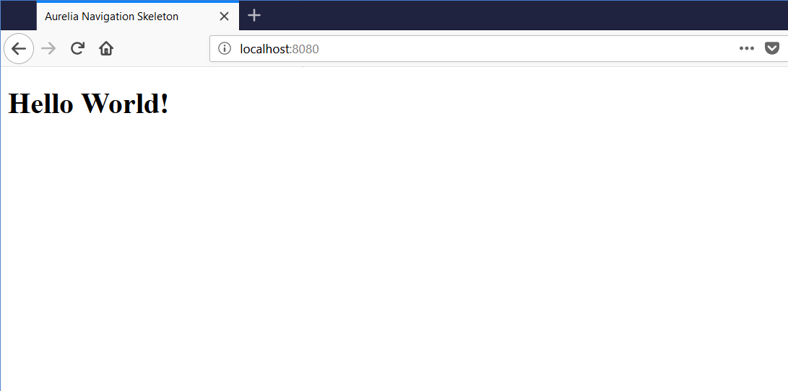

# Getting Started with Aurelia

Before we start writing code. you will need to get setup with the tools we will be using
to create the application. We will be using the aurelia comand line tool to create the project
structure. The Aurelia CLI will allow to choose between to popular programming language options: ESNext and typescript. In this tutorial we will be using ESnext as our programming language.  
  
## Prerequisites

The first thing that you will need to have installed is node.js it can be downloaded 
from here https://nodejs.org/. Which can be downloaded from the provided link. After following the installation instructions for node. 

After installing node, we need to use the node package manager to install the aurelia cli globally
that can be done using this command:

```shell 
npm install -g aurelia-cli
```

## What You Will Be Building

Our todo application contains a list of ```Todo``` instances. It can add and remove todos. The todos are added by allowing a user to provide a todo description. Once they type a description and add the todo, the description is cleared so they can create another todo. 

## Creating the Todo Project

To create the project run the following command: ```au new todos``` accepting all of the default options.

## Running the Project
The aurelia cli has a built in command to run your newly created project ```au run --watch```
the watch flag will cause your browser to reload the app each time that a file is changed.

**NOTE:** Currently the ```--watch``` flag is required or there will be an error because of a bug in webpack.

Now that the project is running, open up a web browser and navigate to http://localhost:8080/
you should see some thing like:



You will notice that the text displayed for the title in the browser tab reads: Aurelia Navigation Skeleton. let's change that now. open the ```webpack.config.js``` file in the root folder of the application. Find the line that reads:

```javascript 
const title = 'Aurelia Navigation Skeleton';
``` 
and change it to 
```javascript 
const title = 'Todos';
``` 

when you save this file the browser window refresh. and the title will display the new title.  


## The App Component

In Aurelia a component is made up of two files an Html file containing the view and a js file
containing the view model. 

The App component view model will be located in the ```src``` folder modifiy the the one generated by the 
cli to look lik this: 

```javascript
export class App {
  heading = 'Todos';
}
```
and update the view also located in the ```src``` folder to look like this:

```html
<template>
  <h1>${heading}</h1>
</template>
```
## Adding a Todo

Since we are making a Todo App, We are going to begin by creating a ```Todo``` class to model an individual Todo item. In the ```src``` folder of your project, create the following file: 

```javascript 
export class Todo {
  done = false;
  description = "";
  
  constructor(description){
    this.description = description;
  }
}
```

Update the App component view model to look like this:

```javascript
import { Todo } from "./todo";

export class App {
  heading = 'Todos';
  todos = [];
  todoDescription = "";

  addTodo() {
    if(this.todoDescription){
      this.todos.push(new Todo(this.todoDescription));
      this.todoDescription = "";
    }
  }
}
```
Update the App component view, to look like this:

```html
<template>
  <h1>${heading}</h1>

  <form submit.trigger="addTodo()">
    <input type="text" value.bind="todoDescription">
    <button type="submit">add Todo</button>
  </form>
</template>
```

## Displaying the List of Todos

```html
<template>
  <h1>${heading}</h1>

  <form submit.trigger="addTodo()">
    <input type="text" value.bind="todoDescription">
    <button type="submit">add Todo</button>
  </form>
  
  <ul>
    <li repeat.for="todo of todos">
      <input type="checkbox" checked.bind="todo.done">
      <span>${todo.description}</span>
    </li>
  </ul>
</template>
```

## Removing a Todo

Update the  app view model to look like this:

```javascript
import { Todo } from "./todo";

export class App {
  heading = 'Todos';
  todos = [];
  todoDescription = "";

  addTodo() {
    if(this.todoDescription){
      this.todos.push(new Todo(this.todoDescription));
      this.todoDescription = "";
    }
  }

  removeTodo(todo) {
    let index = this.todos.indexOf(todo);
    if (index !== -1) {
      this.todos.splice(index, 1);
    }
  }
}
```

Update the app view to look like this:

```html
<template>
  <h1>${heading}</h1>

  <form submit.trigger="addTodo()">
    <input type="text" value.bind="todoDescription">
    <button type="submit">add Todo</button>
  </form>
  
  <ul>
    <li repeat.for="todo of todos">
      <input type="checkbox" checked.bind="todo.done">
      <span>${todo.description}</span>
      <button click.trigger="removeTodo(todo)">Remove</button>
    </li>
  </ul>
</template>
```

### Marking a Todo Complete

update the app view to like this:

```html
<template>
  <h1>${heading}</h1>

  <form submit.trigger="addTodo()">
    <input type="text" value.bind="todoDescription">
    <button type="submit">add Todo</button>
  </form>
  
  <ul>
    <li repeat.for="todo of todos">
      <input type="checkbox" checked.bind="todo.done">
      <span css="text-decoration: ${todo.done ? 'line-through' : 'none'}">${todo.description}</span>
      <button click.trigger="removeTodo(todo)">Remove</button>
    </li>
  </ul>
</template>
```

## Where To Go From Here

- [Contact Manager Tutorial](http://aurelia.io/docs/tutorials/creating-a-contact-manager)
- [Discourse Server](https://discourse.aurelia.io/)
- [Gitter](https://gitter.im/aurelia/Discuss)
